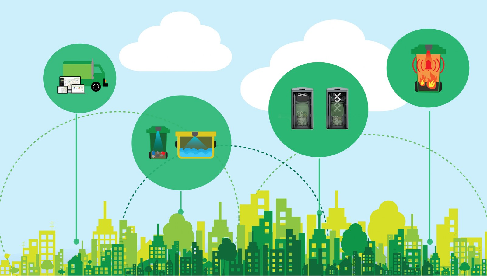

# TrashFullnessSensor
Датчик наполнения мусорных контейнеров.
Система позволяет пользователю получить информацию о наполненности мусорных контейнеров. Тем самым помогает ему решить задачи оптимизации и эффективности предоставления услуг по управлению отходами.

## Авторы
- [@vladimirkutkovoy](https://www.github.com/vladimirkutkovoy)
